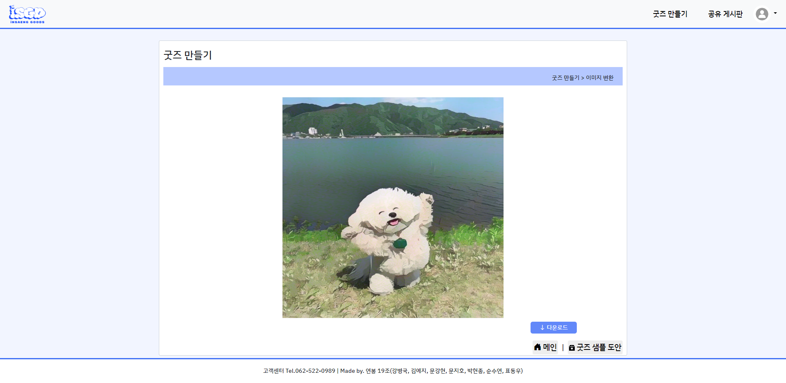
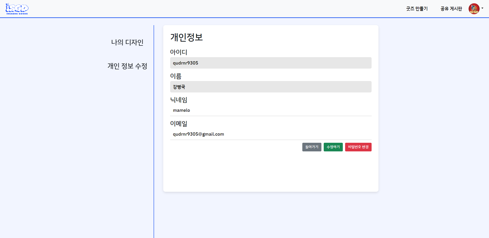
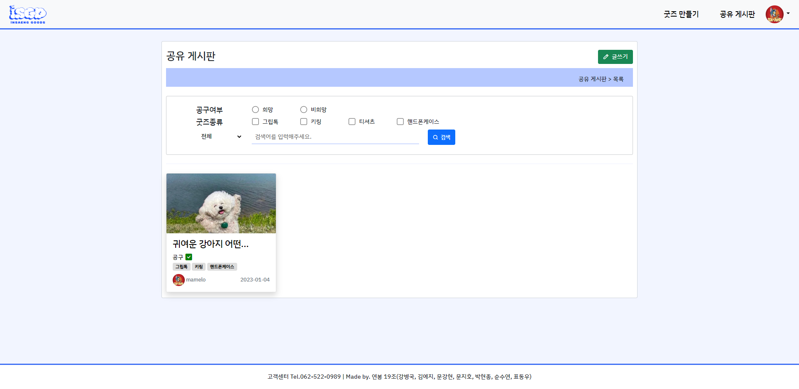
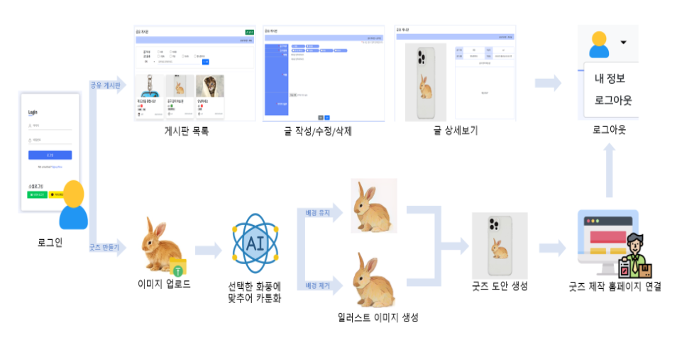

<h1 align="center">Welcome to InSaeng Goods </h1>
<p>
</p>
<center>
    
</center>


> INSAENG GOODS / 인생굿즈 (AIVLE 2기 최종프로젝트)

### 🏠 [Github]() :clapper:[Demo 시연영상]() :page_with_curl:[프로젝트 명세서]() :microphone:[Presentation]()

<br>

## 📕 Description

```sh
인생굿즈는 개성을 중시하고 자신을 표현하는데 망설임이 없는 MZ세대를 위해 자신만의 이미지를 일러스트화 하고
굿즈 도안까지 생성할 수 있도록 도와주는 서비스 입니다.
```


## :pushpin: Project Goal

```sh
 주 소비층으로 떠오른 MZ세대는 개성을 중시하고 자신을 표현하는데 망설임이 없습니다.
 같은 물건을 사더라도 세상에 단 하나뿐인 유니크한 제품을 선호합니다. 
 이니셜을 새기는 등 자신만의 커스터마이징을 통해 소장가치를 높이고 정체성을 드러내고 있습니다.

 또한 '이유 불문하고 나를 위해 아낌없이 쓰는 소비 행위'를 일컬었던 미코노미가
 '나에게 가치 있는 소비에 적극적으로 지갑을 연다'는 의미로 통용되며,
 MZ세대에게는 자신의 가치관과 스스로의 만족도가 구매를 결정하는 주요 요인이 되었습니다.
 
 인생굿즈는 획일화된 제품에서 벗어나 자신만의 개성있는 이미지와 도안을 AI를 활용하여 쉽게 생성하고
 이를 공유하는 플랫폼을 제공함으로서 MZ세대에게 자신만의 굿즈를 만들 수 있는 기회와 서비스를 제공합니다.
```


## :mag: 서비스 기능

<center>
    
</center>


## :mag: Overview

### 1. 유저 로그인  & 회원가입 페이지(User Login & Signup Page) 

<center>
    
</center>

<center>
    
</center>

Django Form을 활용한 로그인 및 회원가입

<center>
    
</center>

<center>
    
</center>


Kakao와 Naver API를 이용한 소셜 로그인 (Allauth)

<br>

### 2. AI 모델을 활용한 이미지 변환 및 굿즈 도안 제작

<center>
    
</center>

<center>
    
</center>

<center>
    
</center>

이미지 변환

<center>
    
</center>


이미지 변환 및 배경 제거

<center>
    
</center>


굿즈 도안 생성 및 굿즈 제작 업체와 연결

<br>

### 3. 프로필 & 개인정보 변경 및 탈퇴

<center>
    
</center>

<center>
    
</center>

<center>
    
</center>

<center>
    
</center>

<center>
    
</center>

<center>
    
</center>

<center>
    
</center>

프로필 및 개인정보 수정, 삭제

<br>

### 4. 게시판을 활용한 게시글 및 댓글 작성

<center>
    
</center>

<center>
    
</center>

<center>
    
</center>

<center>
    
</center>

<br>


## :wrench: Tech Stack


<center>
    
</center>


## 🛶 Service flow

<center>
    
</center>

<br>

## :pencil2: ERD

<center>
    
</center>
<br>

## :runner: Steps to run

```bash
$ cd BP
$ python -m venv venv
$ source venv/Scripts/activate
$ python install -r requirements.txt
$ python manage.py runserver
```

<br>

## 🤼‍♂️Author

Team Leader : 🐯**Moon Kanghyeon**

Backend : 🐶 **Kim Yeji**

Backend: 🐺 **Moon Jiho**

Frontend : 🐱 **Kang Byeongkuk**

Frontend : 🦁 **Soon Suyeon**

AI-modeling: 🐹 **Pyo Dongwoo**

AI-modeling: 🐸 **Park Hyeonjong**

<hr>

## 📝 License

Copyright © 2023  INSAENG GOODS  <br>

